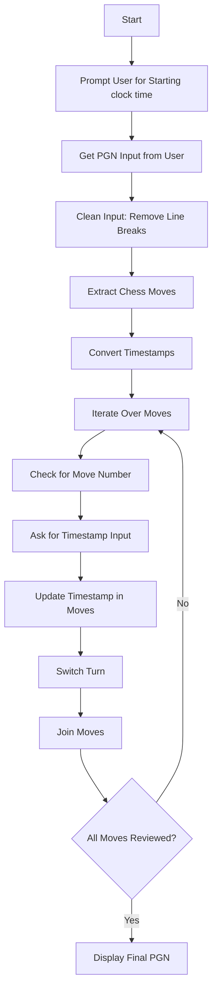

# Use
CLI tool to convert your manuscript chess scoresheet into valid PGN format to import anywhere you want with timestamps. Just follow the prompted instructions.

# Activity diagram

```mermaid
graph TB
    A[Start]
    A --> B[Prompt User for Starting clock time]
    B --> C[Get PGN Input from User]
    C --> D[Clean Input: Remove Line Breaks]
    D --> E[Extract Chess Moves]
    E --> F[Convert Timestamps]
    F --> G[Iterate Over Moves]
    G --> H[Check for Move Number]
    H --> I[Ask for Timestamp Input]
    I --> J[Update Timestamp in Moves]
    J --> K[Switch Turn]
    K --> L[Join Moves]
    L --> O{All Moves Reviewed?}
    O -- No --> G
    O -- Yes --> P[Display Final PGN]
```
